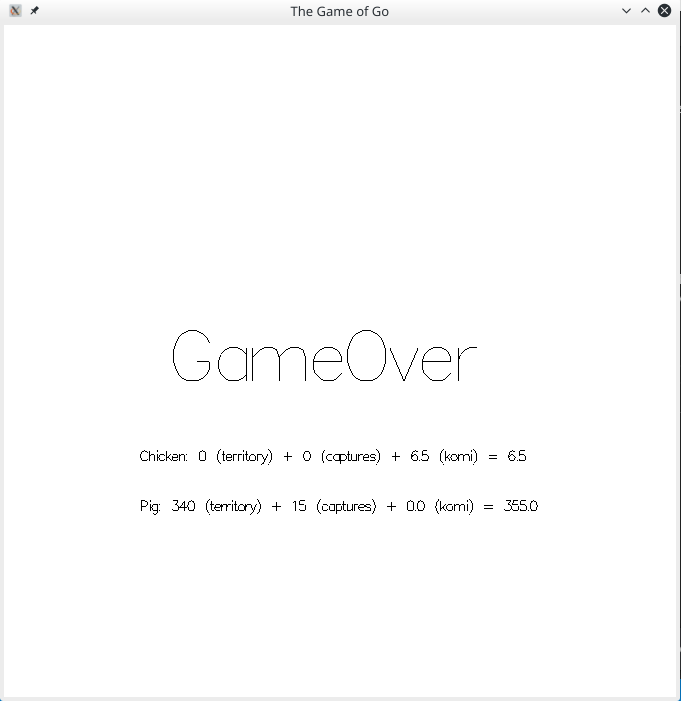

# The Game of Go
### The Logical Rules
1. Go is played on a 19x19 square grid of points, by two players called Black and White.
2. Each point on the grid may be colored black, white or empty.
3. A point P, not colored C, is said to reach C, if there is a path of (vertically or horizontally) adjacent points of P's color from P to a point of color C.
4. Clearing a color is the process of emptying all points of that color that don't reach empty.
5. Starting with an empty grid, the players alternate turns, starting with Black.
6. A turn is either a pass; or a move that doesn't repeat an earlier grid coloring.
7. A move consists of coloring an empty point one's own color; then clearing the opponent color, and then clearing one's own color.
8. The game ends after two consecutive passes.
9. A player's score is the number of points of her color, plus the number of empty points that reach only her color.
10. The player with the higher score at the end of the game is the winner. Equal scores result in a tie. 

### Control

Press left mouse booton to set a piece.

Press right to pass a turn.